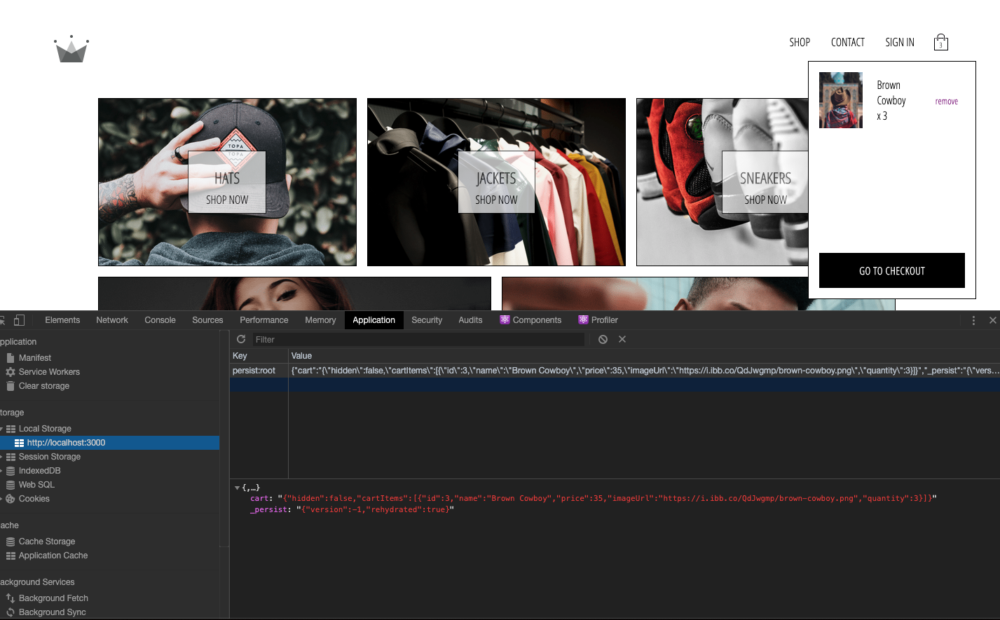
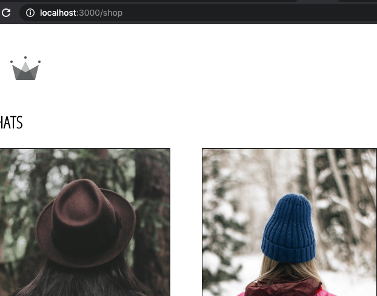
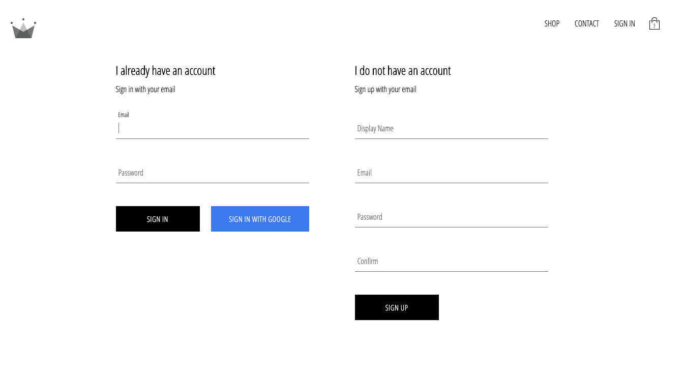

# CHIVOLVE

## An E-Commerce application using React and Redux

## Technologies

### React, Redux, Reselect, Persist, React-Router

**Redux** was used to create a global store. From the global store various components pull in their state. User interaction is also handled through Redux where actions are dispatched by the store to respective reducers.

The **Reselect** library was used to implement memoization so that components would not unecessarily re-render.

**Redux-Persist** was implemented so that the cart items would persist through sessions.

**React Router** was used to handle routes and the rendering of page components

### Firebase

**Firebase** database and authentication was used to handle sign-in and sign up. The Google OAuth provider was implemented to allow users to sign on with email and password or their Google accounts

### React Hooks and Graph QL

Coming soon

From the project directory run:

### `npm start`

this runs the app in the development mode. 
Open [http://localhost:3000](http://localhost:3000) to view it in the browser.

